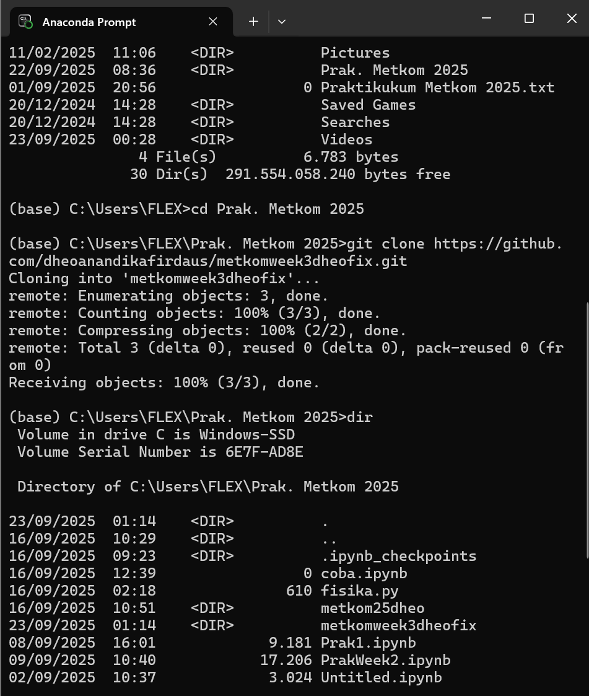
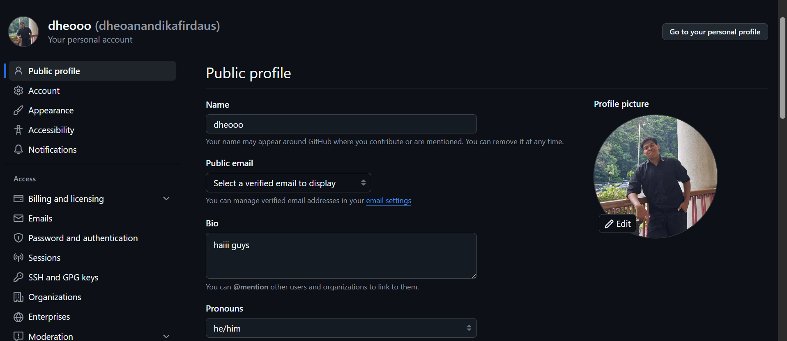
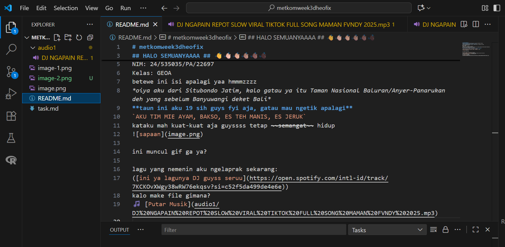

## HALO SEMUANYAAAA ## 👋👋🏻👋🏼👋🏽👋🏾👋🏿
'Kenalin aku Dheo Anandika Firdaus, temen-temen bisa panggil aku Dheo'
NIM: 24/535035/PA/22697
Kelas: GEOA
betewe ini isi apalagi yaa hmmmzzzz 
*oiya aku dari Situbondo Jatim, kalo gatau ya itu Taman Nasional Baluran/Anyer-Panarukan deh yang sebelum Banyuwangi deket Bali*
**taun ini aku 19 sih guys fyi aja, gatau mau ngetik apalagi**
`AKU TIM MIE AYAM, BAKSO, ES TEH MANIS, ES JERUK`
kataku mah kuat-kuat aja guyssss tetap ~~semangat~~ hidup
mmfff yhh gusy kalo sama hehe ni dikerjain `jam 2.51 WIB 23/09/2025`

## **1. Langkah-Langkah Membuat Repository** ##
1. Login ke akun GitHub.
2. Klik tombol **New Repository**.
3. Beri nama repository (contoh: `tugas-markdown`).
4. (Opsional) Centang opsi **Add a README file**.
5. Klik **Create Repository**.

## 2. Clone Repository ke Lokal
- Buka `Anaconda Prompt`
- Arahkan ke folder penyimpanan:
  dir kemudian pilih
  (base) C:\Users\FLEX>cd Prak. Metkom 2025
dan seterusnya sesuai image di bawah:

habis itu:
(base) C:\Users\FLEX\Prak. Metkom 2025>cd metkomweek3dheofix

(base) C:\Users\FLEX\Prak. Metkom 2025\metkomweek3dheofix>git config --global user.mail "dheoanandikafirdaus@mail.ugm.ac.id"

(base) C:\Users\FLEX\Prak. Metkom 2025\metkomweek3dheofix>git init
Reinitialized existing Git repository in C:/Users/FLEX/Prak. Metkom 2025/metkomweek3dheofix/.git/
kalo udah **WAJIB disave ajaa**, terus:
1. git add .
2. git commit -m "..."
3. git push
4. buka lagi GitHub terus reload, udah deh...
wahh ternyata work yak guysss keren jugaaa hehe maklum perintizzzz bukan pewarizz

Fitur yang baru dicoba:
1. 
2. 
3. git commit, git add, git push, git clone, git config